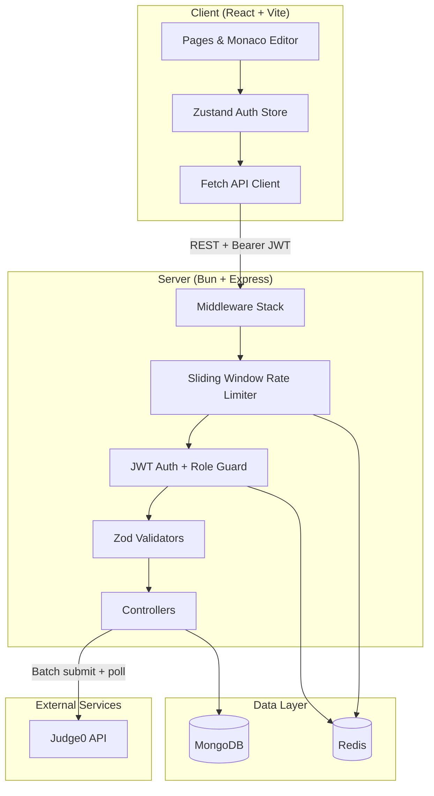

# 🚀 LeetCode Clone

**Live Demo:** [https://leetcode-clone-murex.vercel.app](https://codeforge1.vercel.app/) &nbsp;|&nbsp; **Backend API:** [https://leetcodeclone.duckdns.org](https://leetcodeclone.duckdns.org)

A LeetCode-style coding platform where users can practice coding problems, submit solutions, and track their progress.


---

## Table of Contents

- [Features](#features)
- [Tech Stack](#tech-stack)
- [Architecture](#architecture)
- [Code Execution (Judge0)](#code-execution-judge0)
- [Rate Limiting — Sliding Window](#rate-limiting--sliding-window)
- [Authentication & JWT Token Blacklisting](#authentication--jwt-token-blacklisting)
- [Database Indexing](#database-indexing)
- [API Overview](#api-overview)
- [Project Structure](#project-structure)
- [Getting Started](#getting-started)
- [Environment Variables](#environment-variables)

---

## Features

### User-facing
- **Sign up / log in / log out** with JWT-based sessions
- **Browse problems** filtered by difficulty and tags (array, linkedList, graph, dp)
- **Monaco Editor** for writing solutions in C++, Java, or JavaScript
- **Run** — execute code against **visible** (sample) test cases without persisting a submission
- **Submit** — evaluate against **hidden** test cases; track runtime, memory, pass/fail status
- **Submission history** per problem
- **Profile page** with solved-problem count and progress tracking

### Admin-facing
- **Create / update / delete** problems
- **Reference solution validation** — before a problem is saved, the admin's reference solution is executed against all visible test cases via Judge0; the problem is rejected if any case fails
- **Admin-only signup** — only existing admins can register new admin accounts
- **Starter code templates** per language

### Platform / infrastructure
- **Sliding-window rate limiting** on auth and submission routes (Redis sorted sets)
- **JWT token revocation** on logout via Redis blacklist
- **Role-based access control** (user vs admin)
- **Request validation** with Zod schemas
- **Cascade delete** — deleting a user removes their submissions

---

## Tech Stack

| Layer | Technology |
|-------|------------|
| **Frontend** | React 19, TypeScript, Vite 6, Tailwind CSS 4, React Router 7, Zustand, Monaco Editor |
| **Backend runtime** | [Bun](https://bun.sh) |
| **Backend framework** | Express 5, TypeScript |
| **Database** | MongoDB with Mongoose 9 |
| **Cache / rate limit / token store** | Redis 6 (`node-redis` client) |
| **Code execution** | [Judge0 CE](https://github.com/judge0/judge0) (external API) |
| **Auth** | JSON Web Tokens (`jsonwebtoken`), bcrypt (10 salt rounds) |
| **Validation** | Zod 4 |

---

## Architecture



**Request flow for a submission:**
1. Client sends `POST /submission/submit/:problemId` with code and language.
2. Rate limiter checks Redis ZSET for the client's IP + path.
3. Auth middleware verifies JWT and checks Redis for revoked tokens.
4. Zod validates the request body.
5. Server loads hidden test cases from MongoDB, builds a batch payload, and sends it to Judge0.
6. Server polls Judge0 with returned tokens until all executions finish (`status.id > 2`).
7. Results are aggregated; submission is saved; user's `problemSolved` array is updated on full pass.

---

## Code Execution (Judge0)

Code is **not** executed on the application server. All compilation and execution is delegated to **Judge0 CE** via its REST API.

### Supported languages

| Language | Judge0 `language_id` |
|----------|---------------------|
| C++ | 54 |
| Java | 62 |
| JavaScript | 63 |

### Batch submission

Both **Run** and **Submit** use Judge0's batch endpoint to run all test cases in parallel:

```
POST {JUDGE0_URL}/submissions/batch?base64_encoded=false
Body: { submissions: [{ source_code, language_id, stdin, expected_output }, ...] }
Response: [{ token: "..." }, ...]
```

### Token polling

Judge0 returns immediately with a token per test case. The server polls until every submission reaches a terminal state (`status.id > 2`, where `3` = Accepted):

```
GET {JUDGE0_URL}/submissions/batch?tokens=token1,token2,...&base64_encoded=false
```

The polling loop waits 1 second between requests until all results are ready.

### Run vs Submit

| Action | Test cases used | Persisted? | Rate limit |
|--------|----------------|------------|------------|
| **Run** | `visibleTestCases` (shown to user) | No | 20 req / 60s |
| **Submit** | `hiddenTestCases` (never exposed) | Yes — full submission record | 10 req / 60s |

### Problem creation validation

When an admin creates or updates a problem, each reference solution is run against all visible test cases through the same Judge0 batch + poll pipeline. If any case does not return `status.id === 3` (Accepted), the problem is rejected with the corresponding error (Wrong Answer, TLE, Compilation Error, etc.).

### Status mapping

Judge0 status IDs are mapped to human-readable messages and stored submission statuses:

- `3` → Accepted
- `4` → Wrong Answer
- `5` → Time Limit Exceeded
- `6` → Compilation Error
- `7–10, 12` → Runtime Error

---

## Rate Limiting — Sliding Window

Rate limiting is implemented as a **sliding window** algorithm using **Redis sorted sets (ZSET)**, not a fixed window counter or token bucket.

### How it works

For each request, a Redis key is built from the client IP and route path:

```
rate_limit:{ip}:{path}
```

Steps on every request:

1. **Trim expired entries** — `ZREMRANGEBYSCORE key 0 (now - windowSize)` removes timestamps outside the window.
2. **Count current requests** — `ZCARD key` returns how many requests fall inside the window.
3. **Reject if over limit** — return `429 Too Many Requests`.
4. **Record this request** — `ZADD key score member` where `score = current Unix timestamp` and `member = "{timestamp}:{random}"` (unique member per request).
5. **Set TTL** — `EXPIRE key windowSize` so idle keys are cleaned up.

This gives a **true sliding window**: the limit applies to the last N seconds of requests, not a fixed calendar bucket. It is more accurate than fixed-window counters (which allow burst spikes at window boundaries) and simpler than token bucket for per-route limits.

### Configured limits

| Route | Window | Max requests |
|-------|--------|--------------|
| `POST /auth/signup` | 300s (5 min) | 3 |
| `POST /auth/admin/signup` | 300s | 3 |
| `POST /auth/login` | 60s | 5 |
| `POST /submission/run/:problemId` | 60s | 20 |
| `POST /submission/submit/:problemId` | 60s | 10 |

Submission endpoints have stricter limits because each request triggers multiple Judge0 executions (one per test case), making them expensive.

---

## Authentication & JWT Token Blacklisting

### JWT issuance

On successful login, the server signs a JWT containing:

```json
{ "_id": "<user ObjectId>", "role": "user" | "admin" }
```

- Signed with `JWT_KEY`
- Expires in **7 days** (`604800` seconds)
- Returned to the client; stored in `localStorage` and sent as `Authorization: Bearer <token>`

Passwords are hashed with **bcrypt** (10 rounds) before storage. Email is stored lowercase and unique.

### Auth middleware

Every protected route runs through middleware that:

1. Extracts the Bearer token from the `Authorization` header.
2. Checks Redis for `logout:{token}` — if present, the token was revoked and the request is rejected with `401`.
3. Verifies the JWT signature and expiry with `jwt.verify()`.
4. Attaches `req._id` and `req.role` for downstream handlers.

### Logout / token revocation

JWTs are stateless by default — once issued, they remain valid until expiry. To support logout, revoked tokens are stored in Redis:

```
SET logout:{token} 1 EX 604800
```

The TTL matches the JWT lifetime so blacklist entries auto-expire. On every authenticated request, the middleware checks this key before verifying the JWT. This is a common **token blacklist** pattern for stateless auth without a session table.

### Role-based access control

Two roles: `user` and `admin`.

- A `required_role(Role.ADMIN)` middleware gate protects admin-only routes (problem CRUD, admin signup).
- Regular users can browse, run, submit, and view their profile/solved list.

---

## Database Indexing

### MongoDB indexes

**User — unique email**

The `emailId` field has `unique: true` on the schema, creating a unique index for fast login lookups and duplicate prevention on signup.

**Submission — compound index**

```js
SubmissionSchema.index({ userId: 1, problemId: 1 })
```

This compound index optimizes the most common submission query: fetching all submissions for a given user on a specific problem (`GET /submission/:problemId`). Without it, MongoDB would perform a collection scan as submission volume grows.

**User — solved problems tracking**

The `problemSolved` field is an array of ObjectIds referencing Problem documents. On a fully accepted submission, the problem ID is added with `$addToSet` (no duplicates). The solved-problems endpoint uses `.populate()` to return problem metadata.

### Redis key patterns

| Key pattern | Purpose | TTL |
|-------------|---------|-----|
| `rate_limit:{ip}:{path}` | Sliding window request timestamps (ZSET) | `windowSize` seconds |
| `logout:{jwt}` | Revoked token blacklist | 7 days |

---

## API Overview

### Auth — `/auth`

| Method | Path | Auth | Rate limit | Description |
|--------|------|------|------------|-------------|
| POST | `/signup` | — | 3 / 5 min | Register a user |
| POST | `/login` | — | 5 / 60s | Login, receive JWT |
| POST | `/logout` | JWT | — | Revoke token |
| GET | `/getProfile` | JWT | — | Get current user profile |
| DELETE | `/` | JWT | — | Delete account |
| POST | `/admin/signup` | Admin JWT | 3 / 5 min | Register a new admin |

### Problems — `/problem`

| Method | Path | Auth | Role | Description |
|--------|------|------|------|-------------|
| GET | `/` | JWT | Any | List all problems |
| GET | `/:id` | JWT | Any | Get problem (no hidden tests) |
| GET | `/user` | JWT | Any | List solved problems |
| POST | `/create` | JWT | Admin | Create problem |
| PUT | `/:id` | JWT | Admin | Update problem |
| DELETE | `/:id` | JWT | Admin | Delete problem |

### Submissions — `/submission`

| Method | Path | Auth | Rate limit | Description |
|--------|------|------|------------|-------------|
| POST | `/run/:problemId` | JWT | 20 / 60s | Run against visible tests |
| POST | `/submit/:problemId` | JWT | 10 / 60s | Submit against hidden tests |
| GET | `/:problemId` | JWT | — | Submission history for problem |

---

## Project Structure

```
Leetcode-clone/
├── client/                  # React frontend (CodeForge UI)
│   ├── src/
│   │   ├── api/             # Typed fetch wrappers
│   │   ├── components/      # Navbar, routes guards, toasts
│   │   ├── pages/           # Landing, login, problems, editor, admin
│   │   └── store/           # Zustand auth state
│   └── package.json
│
├── server/                  # Express API
│   └── src/
│       ├── config/          # MongoDB + Redis connections
│       ├── controllers/     # Route handlers
│       ├── middleware/      # Auth, rate limit, role guard, Zod validation
│       ├── models/          # Mongoose schemas (User, Problem, Submission)
│       ├── router/          # Express routers
│       ├── types/           # TypeScript types
│       ├── utils/           # Judge0 helpers, JWT, language mapping
│       └── validators/      # Zod schemas
│
└── readme.md
```

---

## Getting Started

### Prerequisites

- [Bun](https://bun.sh) (server)
- Node.js 18+ (client)
- MongoDB instance (local or Atlas)
- Redis instance (local or cloud)
- Judge0 CE instance or hosted API key ([RapidAPI Judge0](https://rapidapi.com/judge0-official/api/judge0-ce) or self-hosted)

### Server

```bash
cd server
bun install
# Create a .env file (see below)
bun run dev
```

### Client

```bash
cd client
npm install
# Set VITE_API_URL in .env if backend is not on localhost:3000
npm run dev
```

The client runs at `http://localhost:5173` by default. The server listens on the port set in `PORT`.

---

## Environment Variables

### Server (`server/.env`)

| Variable | Description |
|----------|-------------|
| `PORT` | Server port (e.g. `3000`) |
| `DB_CONNECT_STRING` | MongoDB connection URI |
| `REDIS_HOST` | Redis host |
| `REDIS_PORT` | Redis port |
| `REDIS_PASSWORD` | Redis password |
| `JWT_KEY` | Secret for signing JWTs |
| `JWT_EXPIRY_SEC` | Referenced for logout TTL |
| `JUDGE0_KEY` | Judge0 API base URL (e.g. `https://judge0-ce.p.rapidapi.com`) |
| `CLIENT_URL` | Frontend origin for CORS (default `http://localhost:5173`) |

### Client (`client/.env`)

| Variable | Description |
|----------|-------------|
| `VITE_API_URL` | Backend API URL (default `http://localhost:3000`) |

---

## License

Personal project — not licensed for commercial use.
